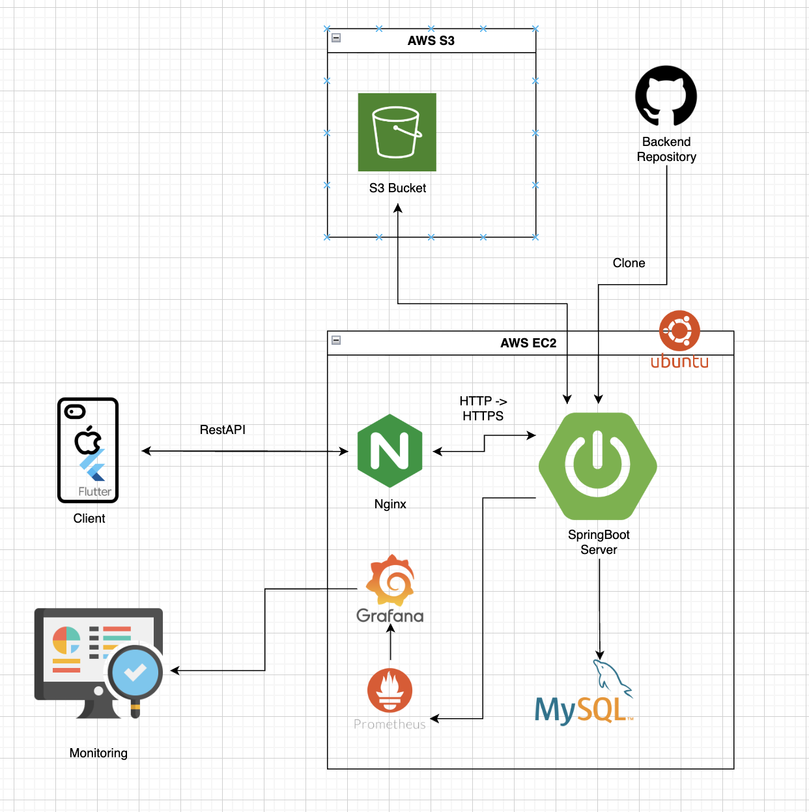
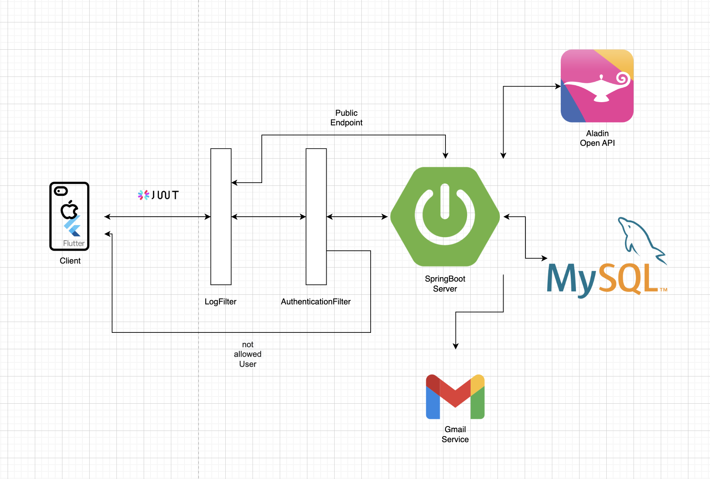
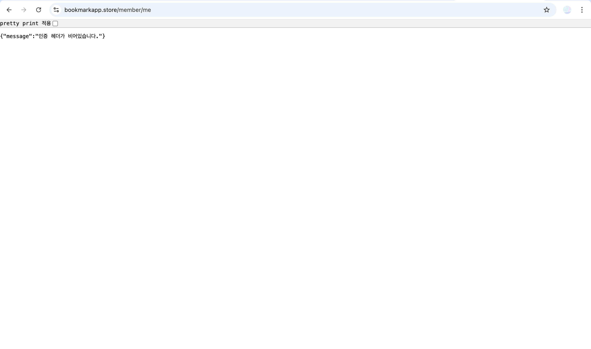
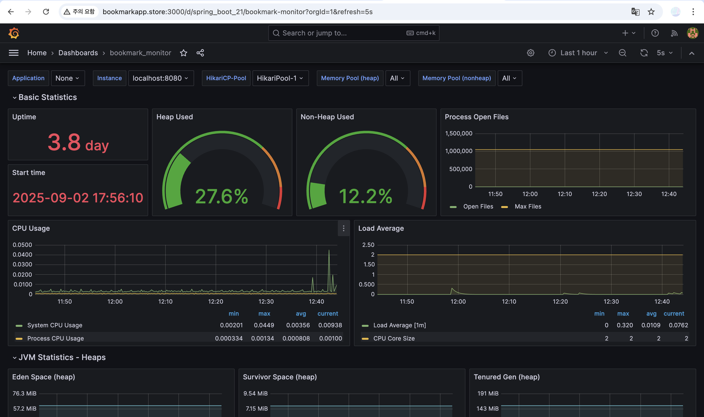

## 🔎 프로젝트 소개

위 프로젝트는 다음과 같은 배경에서 진행되었습니다.

- 책을 읽으면서 인상 깊었던 문장이나 느낀 점들을 기록하고 싶었지만, 노트나 메모장 앱은 체계적으로 관리하기 어렵다는 불편을 느낌.
- 많은 사람들이 책을 읽고도 기록하지 않아 금방 잊어버리는 경우가 많기 때문에 이를 해결하고자 함.
- 독서 경험을 ‘나만의 기록’으로 남길 수 있는 공간이 있으면 좋을 것 같음.

본 서비스에 대한 APP(Flutter) 작업은 [앱 프론트엔드 작업물 페이지](https://github.com/bookmarkproject/bookmark_front)에서 확인할 수 있습니다.

<br>

### 1. 프로젝트 기간

**2025.07.02 ~ 2025.09.04**

<br>

### 2. 포함 내용

1. 프로젝트 소개
2. 사용 기술 스택
3. 시스템 아키텍처
4. 애플리케이션 아키텍처
5. 디렉토리 구조 및 패키지 역할
6. 기술 적용
7. 기술적 이슈 및 프로젝트 고민 사항
8. 관련 서비스 개발
9. 개인 프로젝트 역할

<br>

## 🔧 사용 기술 스택

### Backend

- SpringBoot 3.3.2
- Java 17
- Junit 5

### Database

- H2 (Local)
- MySQL (Dev , Prod)

### Infra

- AWS EC2
- AWS S3
- Nginx (Https)
- Prometheus & Grafana (monitoring)

### Tools

- GitHub
- Postman
- Notion

<br>

## 📌 시스템 아키텍처



1. AWS EC2를 이용하여 서버 구축
2. Nginx를 이용하여 HTTP -> HTTPS 구현
3. Prometheus + Grafana를 활용하여 Monitoring 시스템 구현

<br>

## 🎁 애플리케이션 아키텍처



1. LogFilter를 이용한 로깅 시스템 구축
2. AuthenticationFilter를 이용한 인증 시스템 구현
    - Request Header에서 JWT 토큰을 꺼낸 뒤 유효성 검증
    - Public Endpoint로 지정한 요청 URL은 해당 필터를 거치지 않도록 구현
    - JWT 토큰이 유효하지 않으면 401 응답으로 예외를 발생시킴
3. Controller - Service - Repository 구조로 백엔드 서버 구현
4. Spring Boot Mail (JavaMailSender)을 이용한 이메일 인증번호 발송 시스템 구현
    - Gmail 사용
5. Aladin Open API를 이용한 도서 정보 가져오기 시스템 구현
6. MySQL을 이용한 관계형 데이터 저장

<br> 

## 📂 디렉토리 구조 및 패키지 역할

### Main

```
main
├── java
│   └── com
│       └── example
│           └── bookmarkback
│               ├── auth
│               │   ├── config
│               │   │   └── SecurityConfig.java
│               │   ├── controller
│               │   │   ├── AuthController.java
│               │   │   └── EmailController.java
│               │   ├── dto
│               │   │   ├── AuthCheckType.java
│               │   │   ├── ChangePasswordRequest.java
│               │   │   ├── EmailRequest.java
│               │   │   ├── EmailResponse.java
│               │   │   ├── FindEmailRequest.java
│               │   │   ├── LoginRequest.java
│               │   │   ├── RefreshTokenRequest.java
│               │   │   ├── RefreshTokenResponse.java
│               │   │   └── SignupRequest.java
│               │   ├── entity
│               │   │   ├── EmailVerification.java
│               │   │   └── RefreshToken.java
│               │   ├── infra
│               │   │   ├── JwtUtils.java
│               │   │   ├── LoginJwtUtils.java
│               │   │   └── PasswordChangeJwtUtils.java
│               │   ├── repository
│               │   │   ├── EmailVerificationRepository.java
│               │   │   └── RefreshTokenRepository.java
│               │   └── service
│               │       ├── AuthService.java
│               │       └── EmailService.java
│               ├── book
│               │   ├── cache
│               │   │   ├── BestSellerCache.java
│               │   │   └── LatestBookCache.java
│               │   ├── controller
│               │   │   ├── BookController.java
│               │   │   ├── BookLogController.java
│               │   │   ├── BookLogQuestionController.java
│               │   │   └── BookRecordController.java
│               │   ├── dto
│               │   │   ├── BookLogOverRequest.java
│               │   │   ├── BookLogQuestionResponse.java
│               │   │   ├── BookLogRequest.java
│               │   │   ├── BookLogResponse.java
│               │   │   ├── BookRecordRequest.java
│               │   │   ├── BookRecordResponse.java
│               │   │   └── BookResponse.java
│               │   ├── entity
│               │   │   ├── Book.java
│               │   │   ├── BookLog.java
│               │   │   ├── BookLogQuestion.java
│               │   │   ├── BookRecord.java
│               │   │   ├── LogType.java
│               │   │   └── RecordStatus.java
│               │   ├── repository
│               │   │   ├── BookLogQuestionRepository.java
│               │   │   ├── BookLogRepository.java
│               │   │   ├── BookRecordRepository.java
│               │   │   └── BookRepository.java
│               │   └── service
│               │       ├── AladdinApiService.java
│               │       ├── BookLogQuestionService.java
│               │       ├── BookLogService.java
│               │       ├── BookRecordService.java
│               │       └── BookService.java
│               ├── BookmarkbackApplication.java
│               ├── global
│               │   ├── argumentresolver
│               │   │   └── MemberAuthArgumentResolver.java
│               │   ├── config
│               │   │   ├── RestTemplateConfig.java
│               │   │   ├── S3Config.java
│               │   │   └── WebConfig.java
│               │   ├── dto
│               │   │   ├── ErrorResponse.java
│               │   │   └── MemberAuth.java
│               │   ├── entity
│               │   │   └── BaseEntity.java
│               │   ├── exception
│               │   │   ├── BadRequestException.java
│               │   │   ├── dto
│               │   │   │   └── ExceptionResponse.java
│               │   │   ├── ForbiddenException.java
│               │   │   ├── ResourceNotFoundException.java
│               │   │   ├── RestExceptionHandler.java
│               │   │   └── UnauthorizedException.java
│               │   └── filter
│               │       ├── AuthenticationFilter.java
│               │       ├── LogFilter.java
│               │       └── PublicEndpoint.java
│               ├── member
│               │   ├── controller
│               │   │   └── MemberController.java
│               │   ├── DataInitializer.java
│               │   ├── dto
│               │   │   ├── MemberRequest.java
│               │   │   └── MemberResponse.java
│               │   ├── entity
│               │   │   ├── Gender.java
│               │   │   ├── Member.java
│               │   │   └── Role.java
│               │   ├── repository
│               │   │   └── MemberRepository.java
│               │   └── service
│               │       └── MemberService.java
│               └── test
│                   └── TestController.java
└── resources
    ├── application.yml
    ├── logback-spring.xml
    ├── static
    └── templates
 ```

1. auth : 인증과 관련된 기능을 수행하는 디렉토리
2. book : 도서, 독서 기록과 같은 책과 관련된 기능을 수행하는 디렉토리
3. global : 예외처리, 필터와 같은 전역적인 기능을 수행하는 디렉토리
4. member : 사용자와 관련된 기능을 수행하는 디렉토리
5. test : 간단한 RestAPI 테스트 기능을 수행하는 디렉토리
6. resources : 환경설정, 로깅 설정과 같은 설정 파일의 역할을 수행하는 디렉토리

<br>

### TEST

```
test
├── java
│   └── com
│       └── example
│           └── bookmarkback
│               ├── auth
│               │   ├── controller
│               │   │   └── AuthControllerTest.java
│               │   ├── infra
│               │   │   └── JwtUtilsTest.java
│               │   └── service
│               │       ├── AuthServiceTest.java
│               │       └── EmailServiceTest.java
│               ├── book
│               │   └── service
│               │       ├── BookLogQuestionServiceTest.java
│               │       ├── BookLogServiceTest.java
│               │       ├── BookRecordServiceTest.java
│               │       └── BookServiceTest.java
│               ├── BookmarkbackApplicationTests.java
│               └── global
│                   ├── exception
│                   │   └── RestExceptionHandlerTest.java
│                   └── filter
│                       └── PublicEndpointTest.java
└── resources
    ├── logback-test.xml
    └── test-application.yml
```

main에서 만든 기능을 테스트 하기 위한 패키지 (JUnit)

<br>

## ✅ 기술 적용

### 1. BCryptPasswordEncoder를 통해 보안 강화

```java
package com.example.bookmarkback.auth.config;

import org.springframework.context.annotation.Bean;
import org.springframework.context.annotation.Configuration;
import org.springframework.security.crypto.bcrypt.BCryptPasswordEncoder;
import org.springframework.security.crypto.password.PasswordEncoder;

@Configuration
public class SecurityConfig {

    @Bean
    public PasswordEncoder passwordEncoder() {
        return new BCryptPasswordEncoder();
    }
}
```

- BCrypt 알고리즘을 사용해 비밀번호 + 랜덤한 Salt를 해시값으로 변환
    - 암호화된 값은 "알고리즘 버전 + cost Factor + Random Salt + 해시된 비밀번호"의 구조를 가진다.
    - 사용자가 비밀번호를 입력하면 DB에 저장된 Salt, cost 값 등을 이용하여 같은 방법으로 해싱한 뒤 DB에 저장된 값과 비교한다.
    - 해시된 암호값을 통해 역으로 원래 비밀번호를 알아내는 것은 수학적으로 불가능에 가깝다.

<br>

### 2. 테스트 코드 작성 (JUnit)

```java

@Test
@DisplayName("메일 인증을 완료한 사용자는 회원가입이 정상적으로 진행된다.")
void signupTest() throws Exception {
    //given
    SignupRequest signupRequest = getTestSignupRequest("kkk@gmail.com", "포파");
    saveEmailVerification(signupRequest.email(), true);

    //when
    MemberResponse memberResponse = authService.signup(signupRequest);
    Member savedMember = memberRepository.findById(memberResponse.id()).orElse(null);

    //then
    assertThat(memberResponse.id()).isEqualTo(savedMember.getId());
    assertThat(memberResponse.email()).isEqualTo(savedMember.getEmail());
    assertThat(memberResponse.role()).isEqualTo("USER");

}

@Test
@DisplayName("메일 인증이 되지 않은 사용자는 회원가입시 예외가 발생한다.")
void signupWithoutMailAuthentication() throws Exception {
    //given
    SignupRequest signupRequest = getTestSignupRequest("kkk@gmail.com", "포파");
    saveEmailVerification(signupRequest.email(), false);

    //when,then
    assertThatThrownBy(() -> authService.signup(signupRequest))
            .isInstanceOf(BadRequestException.class)
            .hasMessage("이메일 인증을 진행하지 않은 사용자입니다.");
}
```

- 해피 케이스 (정상적인 흐름) vs 예외 케이스 (비정상적인 흐름이 나올 케이스)로 구분 지어서 각각 테스트 코드를 작성함.
- 위 케이스는 "정상적인 회원 가입 vs 메일 인증을 하지 않았을 때 회원가입"로 구분 지어서 테스트 코드 작성

<br>

```java

@AfterEach
void tearDown() {
    emailVerificationRepository.deleteAllInBatch();
    refreshTokenRepository.deleteAllInBatch();
    memberRepository.deleteAllInBatch();
}
```

- @AfterEach 어노테이션을 이용해 각 테스트 케이스가 끝날 때마다 사용한 DB에 있는 모든 데이터를 제거함.
- 각 테스트 케이스들은 다른 테스트들과 독립적으로 실행되어야 하기 때문임.

<br>

### 3. 정규식을 활용하여 Request Body 유효성 검증

```java

@Builder
public record ChangePasswordRequest(

        @NotBlank(message = "비밀번호는 필수 항목입니다.")
        @Size(min = 8, max = 16, message = "비밀번호는 8자 이상 16자 이하여야 합니다.")
        @Pattern(
                regexp = "^(?=.*[A-Za-z])(?=.*\\d)(?=.*[!@#$%^&*()])[A-Za-z\\d!@#$%^&*()]{8,16}$",
                message = "비밀번호는 영어, 숫자, 특수문자(!@#$%^&*())를 최소 1개 이상 포함해야 합니다."
        )
        String password,

        String token
) {

}
```

- 위 케이스는 비밀번호를 8자 이상 16자 이하이고, 영어, 숫자, 특수문자가 최소 1개씩 포함 되어있는지를 검증하는 코드
- 비밀번호 이외에도 Email, name 등의 값들이 null, blank로 들어오는지 확인하여 유효성을 검증

<br>

### 4. Fetch Lazy 전략을 이용한 지연 로딩

```java

@ManyToOne(fetch = FetchType.LAZY)
@JoinColumn(name = "member_id")
private Member member;

@ManyToOne(fetch = FetchType.LAZY)
@JoinColumn(name = "book_id")
private Book book;
```

- 위와 같이 해당 엔티티를 조회할 때 member, book이 필요하지 않은 경우는 DB에 쿼리를 보내지 않도록 지연 로딩으로 설정

<br>

### 5. ArgumentResolver를 이용한 Parameter값 자동 주입

```java

@Component
public class MemberAuthArgumentResolver implements HandlerMethodArgumentResolver {
    @Override
    public boolean supportsParameter(MethodParameter parameter) {
        return parameter.getParameterType()
                .equals(MemberAuth.class);
    }

    @Override
    public Object resolveArgument(MethodParameter parameter, ModelAndViewContainer mavContainer,
                                  NativeWebRequest webRequest, WebDataBinderFactory binderFactory) throws Exception {
        HttpServletRequest httpServletRequest = (HttpServletRequest) webRequest.getNativeRequest();
        if (httpServletRequest.getAttribute("member_id") == null) {
            throw new UnauthorizedException("인증되지 않은 사용자입니다.");
        }
        String memberId = httpServletRequest.getAttribute("member_id").toString();

        return new MemberAuth(Long.valueOf(memberId));
    }
}
```

```java

@GetMapping("/me")
public ResponseEntity<MemberResponse> getMyInfo(MemberAuth memberAuth) {
    MemberResponse memberResponse = memberService.getMyInfo(memberAuth);
    return ResponseEntity.ok(memberResponse);
}
```

- 요청한 사용자의 고유 ID (email이 아닌 고유 번호)는 자주 사용되는 데이터이기 때문에 이 데이터를 주입 시켜주는 역할을 하는 클래스가 필요함.
- SpringMvc의 ArgumentReslover 기능을 활용해 Controller 호출 전에 미리 Member에 대한 고유 ID를 주입하도록 구현

<br>

### 6. Authentication 필터을 이용한 인증 시스템 구현

```java

@Component
@Order(2)
@Slf4j
public class AuthenticationFilter extends OncePerRequestFilter {

    private final ObjectMapper objectMapper;
    private final JwtUtils jwtUtils;

    @Autowired
    public AuthenticationFilter(ObjectMapper objectMapper, @Qualifier("loginJwtUtils") JwtUtils jwtUtils) {
        this.objectMapper = objectMapper;
        this.jwtUtils = jwtUtils;
    }

    @Override
    protected void doFilterInternal(HttpServletRequest request, HttpServletResponse response, FilterChain filterChain)
            throws ServletException, IOException {
        try {
            String authorizationHeader = request.getHeader(HttpHeaders.AUTHORIZATION);
            String jwtToken = jwtUtils.extractToken(authorizationHeader);
            Map<String, Object> memberData = jwtUtils.extractMemberIdAndRole(jwtToken);
            request.setAttribute(JwtUtils.JWT_MEMBER_ID_KEY, memberData.get(JwtUtils.JWT_MEMBER_ID_KEY));
            request.setAttribute(JwtUtils.JWT_ROLE_KEY, memberData.get(JwtUtils.JWT_ROLE_KEY));
            log.info("[요청 멤버 ID] : {}", request.getAttribute(JwtUtils.JWT_MEMBER_ID_KEY));
            MDC.put("userId", request.getAttribute(JwtUtils.JWT_MEMBER_ID_KEY).toString());
            filterChain.doFilter(request, response);
        } catch (Exception e) {
            response.setStatus(HttpStatus.UNAUTHORIZED.value());
            response.setCharacterEncoding(StandardCharsets.UTF_8.name());
            response.setContentType(MediaType.APPLICATION_JSON_VALUE);
            response.getWriter()
                    .write(objectMapper.writeValueAsString(new ErrorResponse(e.getMessage())));
        }
    }

    @Override
    protected boolean shouldNotFilter(HttpServletRequest request) throws ServletException {
        return PublicEndpoint.isPublicEndpoint(request);
    }
}
```

```java
package com.example.bookmarkback.global.filter;

import jakarta.servlet.http.HttpServletRequest;
import java.util.Arrays;
import java.util.List;
import org.springframework.http.HttpMethod;
import org.springframework.util.AntPathMatcher;

public enum PublicEndpoint {
    MailPostEndpoint(HttpMethod.POST, "/mail/**"),
    AuthPostEndpoint(HttpMethod.POST, "/auth/**"),
    AuthGetEndpoint(HttpMethod.GET, "/auth/**"),
    PrometheusGetEndPoint(HttpMethod.GET, "/actuator/prometheus"),
    TestPostEndpoint(HttpMethod.POST, "/test/**"),
    TestGetEndpoint(HttpMethod.GET, "/test/**");


    private static final List<PublicEndpoint> PUBLIC_ENDPOINTS = Arrays.asList(values());
    private static final AntPathMatcher ANT_PATH_MATCHER = new AntPathMatcher();

    private final HttpMethod httpMethod;
    private final String urlPattern;

    PublicEndpoint(HttpMethod httpMethod, String urlPattern) {
        this.httpMethod = httpMethod;
        this.urlPattern = urlPattern;
    }

    public static boolean isPublicEndpoint(HttpServletRequest request) {
        return PUBLIC_ENDPOINTS.stream()
                .anyMatch(publicEndpoint -> publicEndpoint.matches(request));
    }

    public boolean matches(HttpServletRequest request) {
        return httpMethod.matches(request.getMethod()) && ANT_PATH_MATCHER.match(urlPattern, request.getRequestURI());
    }
}
```

- Authentication을 통해서 Request Header에 있는 JWT 토큰을 가져와 유효성을 검증
    - 유효성을 검증하는 역할은 JwtUtils 클래스가 담당
- PublicEndpoint Enum 파일에 지정된 HttpMethod,HttpUrl은 해당 필터를 거치지 않도록 설정
    - 로그인, 이메일 인증등이 이에 해당함.

<br>

### 7. AWS를 이용한 배포

- 다음과 같은 과정으로 배포 과정을 진행함
    1. AWS EC2 인스턴스 생성
    2. 보안 그룹 설정 및 MySQL, Java 설치
    3. 도메인 구매 및 DNS 설정 (AWS Route 53)
    4. Postman을 활용한 HTTP 통신 테스트
    5. Nginx, SSL/TLS 인증서 발급으로 HTTP -> HTTPS 통신 적용
    6. Prometheus + Grafana를 이용한 모니터링 시스템 구축



- Web Url을 이용해 EC2 서버 "/member/me" 엔드포인트에 접근한 사진
    - 현재 JWT 토큰이 존재하지 않기 때문에 401 응답코드가 발생
    - 위 URL은 [여기](https://bookmarkapp.store/member/me)서 확인 가능 (2025.10.6 ~ 현재 금전적인 이유로 서버가 내려간 상태)

    <br>



- Prometheus + Grafana를 이용한 EC2 인스턴스 모니터링

<br>

## ⚒ 기술적 이슈 및 프로젝트 고민 사항

### 1. 비밀번호 변경 API 보안 문제

- 로그인 화면에 있는 버튼을 누른 뒤 인증을 받으면 비밀번호 변경을 할 수 있다.
    - 이 과정은 로그인을 하지 않아도 인증만 받으면 가능해야 함.
    - 따라서 JWT 토큰을 검증하지 않고 이메일 인증만 진행한다.
- 이렇게 되면 외부에 누군가가 postman, curl을 이용해 외부에서 요청을 보내면 이메일 인증을 받지 않고도 비밀번호를 변경할 가능성이 생김
- 위 문제를 해결하기 위해 이메일 인증을 받으면 유효기간이 짧은 엑세스 토큰이 아닌 새로운 토큰을 발급해주고, 비밀번호 변경은 이 토큰을 이용하여 사용자가 유효한지 검증을 한다.

```java

@Transactional
public EmailResponse authNumCheck(EmailRequest emailRequest) {
    String email = emailRequest.email();
    String authNum = emailRequest.authNum();
    EmailVerification foundEmailVerification = emailVerificationRepository.findFirstByEmailOrderByExpiredAtDesc(
            email).orElseThrow(() -> new BadRequestException("인증번호를 발송하지 않은 사용자입니다."));
    validationAuthNum(foundEmailVerification, authNum);

    foundEmailVerification.setVerified(true);
    foundEmailVerification.setVerifiedAt(LocalDateTime.now().plusMinutes(5));

    if (emailRequest.type() != null && AuthCheckType.toEnum(emailRequest.type())
            .equals(AuthCheckType.PASSWORDCHANGE)) {
        Member member = memberRepository.findByEmail(email)
                .orElseThrow(() -> new BadRequestException("가입된 이메일이 존재하지 않습니다."));
        return EmailResponse.response(true, jwtUtils.createAccessToken(member));
    } else {
        return EmailResponse.response(true);
    }
}
```

- 위 코드와 같이 인증번호 검증에 성공하게 되고, 이 요청이 비밀번호 변경 요청이면 새로운 토큰을 발급해준다.

<br>

```java

@Transactional
public void changePassword(@Valid ChangePasswordRequest changePasswordRequest) {
    Long memberId = extractToken(changePasswordRequest.token());
    Member foundMember = memberRepository.findById(memberId)
            .orElseThrow(() -> new BadRequestException("해당 토큰에 해당하는 계정이 존재하지 않습니다."));

    checkEmailVerification(foundMember.getEmail());

    foundMember.setPassword(encodePassword(changePasswordRequest.password()));
    deleteEmailVerification(foundMember.getEmail());
}
```

- 이후 extractToken()을 통해 해당 토큰의 유효성을 검증한 뒤 유효하다면, 비밀번호 변경 과정을 진행한다.

<br>

### 2. RefreshToken 유형

- JWT 방식 vs UUID + DB 방식
    - JWT 방식
        1. DB 조회가 없기 때문에 속도가 빠름.
        2. 하지만 탈취된 토큰을 서버에서 강제로 만료시킬 수 없음.
    - UUID + DB 방식
        1. 탈취된 경우 서버에서 강제로 만료시킬 수 있어 더 안전함
        2. DB 조회가 필요하기 때문에 속도가 더 느릴 수 있음.
- 본 프로젝트에서는 사이드 프로젝트이기 때문에 현재는 보안상 더 좋은 UUID + DB 방식을 채택했고, 추후 성능 이슈가 있을 시 마이그레이션 고려.

```java

@Transactional
public MemberResponse login(LoginRequest loginRequest) {
    Member foundMember = memberRepository.findByEmail(loginRequest.email())
            .orElseThrow(() -> new BadRequestException("존재하지 않는 이메일입니다."));
    if (!matchPassword(loginRequest.password(), foundMember.getPassword())) {
        throw new BadRequestException("비밀번호가 일치하지 않습니다.");
    }

    foundMember.setLastLoginAt(LocalDateTime.now());
    String refreshToken = generatedRefreshToken();
    RefreshToken foundToken = refreshTokenRepository.findByMember(foundMember).orElse(null);
    if (foundToken != null) {
        foundToken.setToken(refreshToken);
        foundToken.setExpiredAt(LocalDateTime.now().plusDays(REFRESH_TOKEN_DURATION));
    } else {
        RefreshToken savedToken = refreshTokenRepository.save(
                new RefreshToken(foundMember, refreshToken,
                        LocalDateTime.now().plusDays(REFRESH_TOKEN_DURATION)));
    }

    return MemberResponse.response(foundMember, jwtUtils.createAccessToken(foundMember), refreshToken);
}
```

- 로그인 시 RefreshToken을 생성하여 발급함.
- 이미 DB에 토큰이 있을 경우 토큰을 새롭게 업데이트, 없을 경우에는 새로운 토큰을 만들어 유효기간을 설정하고 Client에게 반환한다.

<br>

```java

@Transactional
public RefreshTokenResponse refreshToken(@Valid RefreshTokenRequest refreshTokenRequest) {
    String refreshToken = refreshTokenRequest.refreshToken();
    RefreshToken foundToken = refreshTokenRepository.findByToken(refreshToken).
            orElseThrow(() -> new BadRequestException("RefreshToken이 존재하지 않습니다."));
    if (foundToken.getExpiredAt().isBefore(LocalDateTime.now())) {
        refreshTokenRepository.delete(foundToken);
        throw new BadRequestException("유효하지 않은 토큰입니다.");
    }

    String newRefreshToken = generatedRefreshToken();
    foundToken.setToken(newRefreshToken);
    foundToken.setExpiredAt(LocalDateTime.now().plusDays(14));

    return RefreshTokenResponse.response(jwtUtils.createAccessToken(foundToken.getMember()), newRefreshToken);
}
```

- 이후 사용자에게 토큰을 받아 토큰이 일치하는지, 유효시간이 지났는지등의 유효성을 검증한 뒤, 새로운 엑세스 토큰과 리프레쉬 토큰을 반환한다.

<br>

### 3. RestClient 한글 인코딩 문제

- 책 검색 API에서 한글로된 검색어를 보내면 Postman에선 잘 받아오는데, 스프링부트에서는 빈 값이 반환된다.
- 또한 "오늘 밤"과 같이 공백이 있는 검색어를 보내면 공백을 인식하지 못하고 요청을 보낸다.

```
요청 URL : http://www.aladin.co.kr/ttb/api/ItemSearch.aspx?output=js&searchtarget=book&query=%EC%98%A4%EB%8A%98&version=20131101&ttbkey={apikey}
2025-08-02T11:44:32.042+09:00  INFO 47398 --- [nio-8081-exec-1] c.e.b.book.service.BookService           : API 결과 : {version=20131101, logo=http://image.aladin.co.kr/img/header/2011/aladin_logo_new.gif, title=알라딘 검색결과 - %EC%98%A4%EB%8A%98, link=http://www.aladin.co.kr/search/wsearchresult.aspx?KeyWord=%25EC%2598%25A4%25EB%258A%2598&amp;SearchTarget=book&amp;partner=openAPI, pubDate=Sat, 02 Aug 2025 02:44:32 GMT, totalResults=0, startIndex=1, itemsPerPage=10, query=%EC%98%A4%EB%8A%98, searchCategoryId=0, searchCategoryName=전체, item=[]}
```

- 원인은 한글 이중 인코딩 문제, RestApi를 보낼 때 스프링부트에서 restClient.get.uri()를 할 때 한번 더 인코딩이 되기 때문

<br>

```java
 public Map<String, Object> getBookByQuery(Map<String, Object> parameters) {
    Map<String, Object> baseParameter = getBaseParameter();
    baseParameter.putAll(parameters);

    String baseUrl = "http://www.aladin.co.kr/ttb/api/ItemSearch.aspx?";
    StringJoiner sj = new StringJoiner("&");
    for (Map.Entry<String, Object> param : baseParameter.entrySet()) {
        sj.add(URLEncoder.encode(param.getKey(), StandardCharsets.UTF_8).replace("+", "%20") + "=" +
                URLEncoder.encode(String.valueOf(param.getValue()), StandardCharsets.UTF_8).replace("+", "%20"));
    }
    String url = baseUrl + sj.toString();

    URI requestUrl = URI.create(url);

    return restClient.get()
            .uri(requestUrl)
            .retrieve()
            .body(Map.class);
}
```

- 위와 같이 baseUrl에 파라미터를 추가한 URL을 만든 뒤 이것을 URI의 형태로 만들어 더 이상 인코딩되지 않도록 설정함.
- 또한 공백은 넘어올 때 + 로 넘어온다. 그래서 “+”를 문자를 “%20” (공백 인코딩) 으로 바꿔 문제를 해결함.

<br>

## 🥇 관련 서비스 개발

위 앱과 관련된 서비스는 [앱 프론트엔드 작업물 페이지](https://github.com/bookmarkproject/bookmark_front)서 확인 가능.

<br>

## 👬 개인 프로젝트 역할

1. 🐶이세영 [@LSe-Yeong](https://github.com/LSe-Yeong)
    - Spring Boot를 활용한 REST API 서버 개발
    - Filter + Jwt + RefreshToken을 활용한 사용자 인증 시스템 구현
    - Spring Boot Mail (JavaMailSender)을 이용한 이메일 인증번호 발송 시스템 구현
    - Aladin Open Api를 활용한 도서 정보 가져오기 시스템 구현
    - JPA를 활용한 ORM 기반 데이터베이스 연동
    - Junit을 활용한 테스트 코드 작성
    - AWS S3를 활용한 프로필 이미지 저장 및 가져오기 기능 구현
    - AWS EC2를 활용한 서버 배포
    - Prometheus + Grafana를 활용한 모니터링 시스템 구축
    - SLF4J와 Logback을 활용한 로깅 관리

